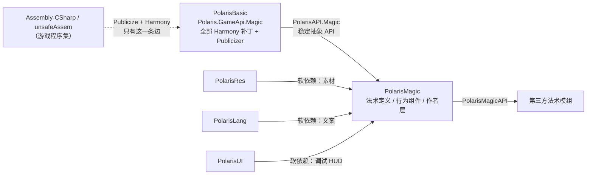
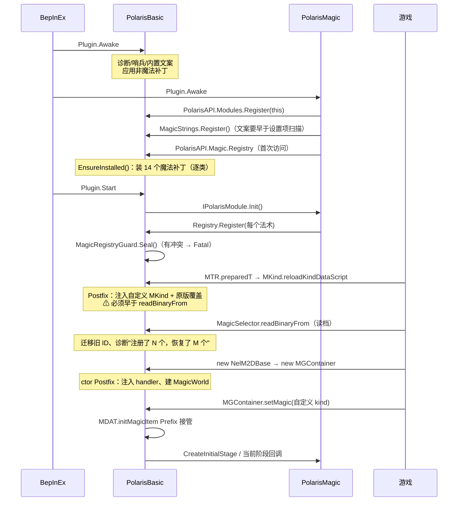

# PolarisMagic 实现方案（技术文档）

> 目标：给 Alice In Cradle（0.29j / Unity 2022.3.62f2 / Mono）实现 Polaris 系列的第五个模块
> **PolarisMagic**——一套"让模组作者能新增、修改玩家魔法"的框架。
> 依据文档：`C:\Users\Administrator\Documents\polarisDocs\魔法系统技术文档-LLM 可读版.md`（下称
> **《魔法文档》**，引用时写章节号，如《魔法文档》§21.6）。
> 依据代码：`E:\Projects\` 下的 PolarisBasic / PolarisRes / PolarisLang / PolarisUI / PolarisTools。
> 写作日期：2026-08-10。

---

## 0. 先给结论

1. **分层是硬约束，不是风格选择。** 所有 Harmony 补丁、所有 Publicizer、所有对游戏私有成员的
   反射，只准出现在 **PolarisBasic**；PolarisMagic 里一个 `[HarmonyPatch]` 都不该有。
   这不是新规矩，是 PolarisBasic 自己写在 `Polaris/GameApi/GameStateAPI.cs:7-15` 和
   `PolarisRes.csproj` / `PolarisLang.csproj` 注释里的既有分层原则：*"PolarisBasic 是整个
   Polaris 系列对游戏内部结构的唯一兼容层……换版本只需要改 PolarisBasic 这一处。"*
   本方案把这条原则贯彻到魔法系统。
   > 顺带记一笔：`PolarisUI.csproj` 目前仍然 `Publicize Assembly-CSharp`，是这条原则的现存例外。
   > 本方案不动它，但 PolarisMagic 不应把它当先例。

2. **PolarisBasic 新增一个"魔法兼容层"**，命名空间 `Polaris.GameApi.Magic`，门面
   `PolarisAPI.Magic`。它翻译的是**游戏的魔法系统结构**（`MGKIND` / `MKind` / `MDAT` /
   `MGContainer` / `MagicItem` / `MgFDHolder` / `MagicNotifiear` / `MagicSelector`），
   不含任何"某个法术好不好玩"的判断。

3. **PolarisMagic 是玩法与作者体验层**：法术定义（数据文件 + 代码 DSL）、行为组件库
   （直射弹 / 持续场 / 环绕体 / 光束 / 陷阱）、资源与文案接线（走 PolarisRes / PolarisLang）、
   调试 HUD（走 PolarisUI）、ID 与存档迁移策略、示例法术。它编译期只引用
   `PolarisBasic.dll`（+ 可选的 PolarisRes/Lang/UI），**不引用 `Assembly-CSharp` / `unsafeAssem`**。

4. **判据（用来裁决"这段代码放哪一层"）：换一次游戏版本，这个 API 的签名需不需要改？**
   - 需要改 → 它描述的是游戏内部结构 → 放 PolarisBasic。
   - 不需要改 → 它描述的是玩法或作者体验 → 放 PolarisMagic。
   这条判据同时解释了为什么 `PolarisAPI.Magic` 不违反"领域概念不进 PolarisAPI"的既有规则
   （见 `Polaris/PolarisAPI.cs:31-33`）：`PolarisAPI.Magic` 暴露的是**游戏自带子系统的结构**，
   和 `PolarisAPI.Game`、`PolarisAPI.Localization` 同类；而"火球飞多远"属于 PolarisMagic。

5. **最难的部分不是"新法术会飞"，是身份、时序与清理。**《魔法文档》§21 列了十几个坑，其中
   会真正伤到玩家存档的是三个：自定义 `MKind` 必须早于 `MagicSelector.readBinaryFrom`（§21.13）、
   保存 ID 必须 ≤ 65535 且条目 ≤ 255（§20.2）、两个模组撞同一个数字 ID 会让旧档静默变成
   另一种法术（§20.2 末）。这三条在 PolarisBasic 侧用**启动期致命错误**处理，做法照抄
   `PolarisLang/Lang/PlangConflictGuard.cs`——那个类为"两个模组撞同一个本地化 key"写的理由，
   逐字适用于"撞同一个 MGKIND"，而且后果更严重（key 撞车只是界面串台，ID 撞车会烧存档）。

6. **工期分九个里程碑（M0–M8）**，前四个不碰存档、不碰自定义枚举，随时可停在一个有用的
   状态上。详见 §7。

---

## 1. 术语、依据与可信度标记

沿用《魔法文档》§1.2 的做法，本方案对每条设计依据也标可信度——因为本方案的作者**没有直接
读过反编译源码**，只读过《魔法文档》和 Polaris 系列现有代码：

| 标记             | 含义                                                                     |
| ---------------- | ------------------------------------------------------------------------ |
| **文档已述**     | 《魔法文档》明确写了，且它自己标了"源码已确认"。可以直接照着写代码。     |
| **本文推断**     | 由《魔法文档》的事实 + Polaris 现有约定推出的设计选择。可以做，但是设计判断，不是事实。 |
| **需核对源码**   | 依赖某个成员的可见性/签名，必须打开反编译结果或用 ILSpy 确认后才能定稿。 |

**凡标"需核对源码"的地方，M0 里必须先核对。** 这不是形式主义：整个方案的可行性取决于
`MagicItem` / `MgFDHolder` / `MKind` 里哪些成员是 public——它们决定 PolarisBasic 的 facade 是
"薄薄一层"还是"要连 Publicizer 一起上"。

术语：

| 术语             | 指                                                                    |
| ---------------- | --------------------------------------------------------------------- |
| 准备圆 / 准备态  | 咏唱阶段那个 `MagicItem`（非 `IMMEDIATE`、`casttime > 0`），《魔法文档》§21.7 |
| 正式实体 / 运行态 | `explode` 之后新建的那个 `MagicItem`（`IMMEDIATE`、`casttime = 0`）    |
| 兼容层           | PolarisBasic 里 `Polaris.GameApi.Magic` 那一坨                         |
| 玩法层           | PolarisMagic                                                          |
| 法术作者         | 用 PolarisMagic 写新法术的第三方模组作者                              |

---

## 2. 分层：PolarisBasic 与 PolarisMagic

### 2.1 依赖方向



**关键性质**：游戏程序集只被 PolarisBasic 碰。换游戏版本时，需要重新验证的补丁签名全部集中
在一个项目里（约 12 个补丁类，见 §4.1）；PolarisMagic 和所有第三方法术模组都不需要重编译，
除非兼容层的公开 API 本身要改。

### 2.2 PolarisMagic 的三条禁令与一个逃生舱

| 禁令                                                        | 为什么                                                                                                                                             |
| ----------------------------------------------------------- | -------------------------------------------------------------------------------------------------------------------------------------------------- |
| 不准出现 `[HarmonyPatch]`                                   | 用户明确要求；而且补丁失败的杀伤半径要由 PolarisBasic 的 `PatchAllIndividually`（`Plugin.cs:87-117`）统一兜住 |
| 不准 `Publicize` 任何游戏程序集                             | 同 PolarisRes/PolarisLang 的 csproj 注释：每加一个 Publicize 就多一份要跟着游戏版本更新的内部结构假设                                              |
| 不准 `Reference Assembly-CSharp` / `unsafeAssem`            | 只要引用了，作者写着写着就会直接摸 `MagicItem.phase`，一年后换版本时没人知道有多少处这么摸过                                                       |
| **逃生舱**：`MagicInstance.RawItem` 返回 `object`           | 兼容层不可能一次抽象全。留一个显式、丑陋、返回 `object` 的出口，比让人偷偷加引用好。用它的模组必须自己引用游戏程序集，并自己承担版本风险；PolarisMagic 自身不用它 |

> **本文推断。** 逃生舱返回 `object` 而不是 `MagicItem`：如果返回类型是游戏类型，PolarisBasic
> 的公开 API 就把游戏程序集拖进了下游的编译期引用闭包，PolarisMagic 想不引用也不行了。

### 2.3 兼容层不做的事

以下三件事**不进** PolarisBasic，理由都是"换游戏版本不需要改它"：

1. 法术数据文件格式（`.pmagic` 或别的）的解析——那是 PolarisMagic 的数据格式，同
   `.plang` 归 PolarisLang 一样。
2. 行为组件库（"直射弹""持续场"这类模板）——那是玩法词汇。
3. 平衡数值、示例法术、作者文档。

---

## 3. PolarisBasic 侧：`PolarisAPI.Magic` API 设计

### 3.1 门面结构

```csharp
// Polaris/PolarisAPI.cs 里加一行
/// <summary>
/// 游戏魔法系统的兼容层：把 MGKIND/MKind/MDAT/MGContainer/MagicItem/MagicSelector 这些
/// 内部结构（含私有字段与必须的 Harmony 补丁）翻译成稳定 API。见 <see cref="GameApi.Magic.MagicAPI"/>。
/// <para>
/// 这里只有"游戏的魔法系统长什么样"，没有"某个法术怎么好玩"——后者在 PolarisMagic。
/// 判据：一个 API 如果换游戏版本不需要改签名，它就不该在这里。
/// </para>
/// </summary>
public static GameApi.Magic.MagicAPI Magic { get; } = new();
```

```csharp
namespace Polaris.GameApi.Magic
{
    public sealed class MagicAPI
    {
        /// <summary>自定义法术的登记处。第一次访问会安装魔法相关的 Harmony 补丁（见 §4.3）。</summary>
        public MagicRegistry Registry { get; }

        /// <summary>改原版八种法术：MKind 覆盖层 + 逐实例攻击覆盖 + 行为钩子。</summary>
        public VanillaMagicAPI Vanilla { get; }

        /// <summary>观察点：文档 §21.16 那一组事件，全部由兼容层集中发出。</summary>
        public MagicEvents Events { get; }

        /// <summary>玩家已获得法术 / 选择位 / 存档参与。</summary>
        public MagicSelectorAPI Selector { get; }

        /// <summary>当前样本是否与兼容层假设的游戏版本一致（见 §4.5）。</summary>
        public MagicCompatStatus Status { get; }
    }
}
```

### 3.2 登记记录：`MagicSpellDefinition`

对应《魔法文档》§21.5 的推荐形状，但把游戏类型全部换成 Polaris 自己的类型：

```csharp
public sealed class MagicSpellDefinition
{
    /// <summary>数字 ID。1..65535（存档格式限制，见文档 §20.2）；建议用 30000–39999 段。</summary>
    public int Id { get; set; }

    /// <summary>友好名，如 "MY_MAGIC"。会双向登记进 FEnum&lt;MGKIND&gt;（§4.1 的 TryParse 补丁）。</summary>
    public string Name { get; set; }

    /// <summary>所属模组，用于冲突报告点名——照 PlangConflict 的做法记 Assembly。</summary>
    public Assembly Owner { get; internal set; }

    /// <summary>基础表（对应 MKind 可写字段）。</summary>
    public MagicKindSpec Kind { get; set; }

    /// <summary>攻击数据。最多三份，对应 MDAT 建的 Atk0/Atk1/Atk2。</summary>
    public IList<MagicAttackSpec> Attacks { get; }

    /// <summary>
    /// 行为工厂。<b>每个 MGContainer 一个实例</b>——原版 handler 会保存容器引用和对象池，
    /// 做成全局单例会跨地图串味（文档 §21.10）。
    /// </summary>
    public Func<MagicBehavior> CreateBehavior { get; set; }

    /// <summary>是否允许存进玩家存档。false 时该法术只能由事件/调试授予，重启即失（见 §5.5）。</summary>
    public bool Persistable { get; set; }

    /// <summary>图标：小图标 PxlFrame 名 + 大图标下标。大图标下标没有越界保护（文档 §18.4）。</summary>
    public MagicIconSpec Icon { get; set; }

    /// <summary>是否套用原版谜题魔法覆盖（结晶 0 / 咏唱夹到 10..20 / 费用 64）。默认 true。</summary>
    public bool FollowPuzzleMagicRules { get; set; } = true;

    /// <summary>旧 ID 迁移映射：{ 旧 ID → 本法术 }，读档时改写。见 §5.5。</summary>
    public IList<int> LegacyIds { get; }
}
```

登记时**同步**校验并在不合格时走 `PolarisAPI.Errors.Fatal`（§4.4）。

### 3.3 运行时实例：`MagicInstance`

这是 API 的核心，也是最容易设计坏的一块。它包住 `MagicItem`，把《魔法文档》里三处最容易
弄错的语义直接编码进类型：

```csharp
public sealed class MagicInstance
{
    // ── 身份 ──────────────────────────────────────────────────────────────
    /// <summary>
    /// 跨地图唯一的实例键。<b>不要用原版 MagicItem.id 当身份</b>：MGContainer.clear 会把
    /// id 计数器归零，同一批 MagicItem 对象换地图后继续复用（文档 §2.3、§21.2）。
    /// 这个键里带兼容层自己的 spawnSerial（永不回退）。
    /// </summary>
    public MagicRuntimeKey Key { get; }

    /// <summary>所属世界（= 一个 MGContainer）。</summary>
    public MagicWorld World { get; }

    /// <summary>true 表示这是咏唱准备圆，false 表示正式实体。见文档 §21.7。</summary>
    public bool IsPreparing { get; }

    // ── 状态机 ────────────────────────────────────────────────────────────
    public int Phase { get; set; }
    public float T { get; set; }
    public float TimeScale { get; }

    public MagicVec3 Position { get; set; }
    public MagicVec3 Velocity { get; set; }
    public float Angle { get; set; }

    // ── 数值 ──────────────────────────────────────────────────────────────
    /// <summary>
    /// <b>语义随阶段变化</b>（文档 §5.8）：准备圆里是"这次施法的 MP 费用"，正式实体里是
    /// "最多还能返还多少魔力的预算"。所以这里刻意<b>不叫</b> Cost；在飞行体上把它写回配置
    /// 费用，改变的是散落魔力而不是玩家扣费。
    /// </summary>
    public float ManaBudget { get; set; }

    public float CrystalizeRatio { get; set; }
    public float NeutralRatio { get; set; }
    public float ProjectilePower { get; set; }

    /// <summary>Atk0/Atk1/Atk2 的 facade；MDAT 没建的那一份返回 null。</summary>
    public MagicAttack Attack0 { get; }
    public MagicAttack Attack1 { get; }
    public MagicAttack Attack2 { get; }

    // ── 施法者与目标 ──────────────────────────────────────────────────────
    public MagicCaster Caster { get; }
    public MagicFaction Faction { get; }     // 由 MGHIT 的 PR/EN/BERSERK 位翻译而来
    public MagicTarget LockonTarget { get; }

    /// <summary>逃生舱：真正的 MagicItem。用它就等于自己承担游戏版本风险（§2.2）。</summary>
    public object RawItem { get; }
}
```

其余 facade：

| 类型                 | 包住的游戏概念              | 关键设计点                                                                                               |
| -------------------- | --------------------------- | -------------------------------------------------------------------------------------------------------- |
| `MagicWorld`         | `MGContainer`               | `Generation`（每次 `initS` 递增）、`FindSpells(id)`、`CountSpells(id)`、`Spawn(...)`                       |
| `MagicAttack`        | `NelAttackInfo`             | `HpDamage` / `MpSplit` / `Element` / `Status` / `KnockbackLength` / `MaxHits`；改值只影响当前实例          |
| `MagicRayShape`      | `M2Ray` 的形状与目标位      | `Circle(r)` / `Box(w,h)` / `Line(len,thick)`；`HITTYPE` 既是输入筛选又带回结果（文档 §6.2），所以拆成两个类型：`MagicRayQuery` 和 `MagicHitResult` |
| `MagicNotifierSpec`  | `MagicNotifiear` + `MnHit`  | 纯数据模板，兼容层用 `Notf.GetForCaster(Mg, template)` 显式重载安装（文档 §21.11），不碰私有 `OMn`         |
| `MagicKindSpec`      | `MKind` 可写字段            | 只暴露解析器真的会读的字段；`knockback_len` 不暴露（文档 §3.3：解析器没有这个分支，字段恒 0）              |
| `MagicCaster`        | `M2MagicCaster`             | `IsPlayer` / `Center` / `AvailableMp` / `ChantSpeed`；八种法术的后半段不是玩家专用（文档 §2.6）            |

### 3.4 行为契约：`MagicBehavior`

运行时不接收状态图，也不让作者在一个总 `OnTick` 中维护框架约定的 phase 数字。一个阶段就是一个 code-behind 回调：

```csharp
public delegate MagicStageResult MagicStageCallback();

public readonly struct MagicStageResult
{
    public static MagicStageResult Stay { get; }
    public static MagicStageResult Complete { get; }
    public static MagicStageResult TransitionTo(MagicStageCallback next);
}

public abstract class MagicBehavior
{
    protected MagicRuntimeContext Context { get; }
    protected abstract MagicStageCallback CreateInitialStage();
    protected virtual void OnDispose(MagicEndReason reason) { }
}
```

每个 Tick 只调用一次当前回调。`Stay` 留在当前阶段，`TransitionTo` 在下个 Tick 切入目标回调，`Complete` 正常结束。分支、中断、循环与共享状态全部使用普通 C# 和 behavior 实例字段。最终清理保持幂等，`OnDispose` 对同一实例只调用一次。

再次施法、绘制和地图退出仍由 holder/兼容层事件进入，但它们不组成另一套阶段图；需要影响运行流程时，只设置实例请求或由下一次阶段回调读取 code-behind 字段。

### 3.5 事件

照《魔法文档》§21.16 原样落地，一个不多一个不少：

```csharp
public sealed class MagicEvents
{
    public event Action<MagicRequest>        Requested;          // OnMagicRequested
    public event Action<MagicInstance>       Initialized;        // OnMagicInitialized
    public event Action<MagicPayment>        PlayerPaid;         // OnPlayerMagicPaid
    public event Action<MagicPhaseChange>    PhaseChanged;       // 只在真变化时发
    public event Action<MagicHit>            Hit;               // 默认关，见下
    public event Action<MagicExplode>        Exploding;          // mode 区分两种语义
    public event Action<MagicSnapshot>       Killed;             // 同一 Key 只发一次
    public event Action<MagicWorldChange>    WorldMapChanged;    // 先递增 generation 再清状态

    /// <summary>
    /// <see cref="Hit"/> 走的是 MGContainer.CircleCast，那是每帧每个存活魔法都会进的极热路径
    /// （文档 §6.5）。默认不安装该补丁；有订阅者时才装，且要求订阅者声明只关心哪些 kind。
    /// </summary>
    public void SubscribeHits(IEnumerable<int> kinds, Action<MagicHit> handler);
}
```

单个订阅者抛异常不连累其它订阅者、责任方按委托所在程序集归因 —— 照
`GameStateAPI.PumpLocale` 的 `GetInvocationList()` 逐个调用写法（`GameApi/GameStateAPI.cs:222-239`）。

---

## 4. PolarisBasic 侧：补丁清单与时序

### 4.1 补丁清单

每一个都是 `Polaris/Patch/` 下的一个文件，命名沿用现有 `Patch_<类型>_<方法>.cs` 约定。
"版本风险"列是换游戏版本时最可能坏掉的点。

| # | 补丁                                        | 类型               | 职责                                                                          | 坏掉的后果                                | 版本风险             |
| - | ------------------------------------------- | ------------------ | ----------------------------------------------------------------------------- | ----------------------------------------- | -------------------- |
| 1 | `MKind.reloadKindDataScript`                | Postfix            | 注入自定义 `MKind`；应用 `Vanilla` 的覆盖层                                    | 新法术完全不存在；改原版数值失效          | 方法名/无 force 语义 |
| 2 | `MDAT.initMagicItem`                        | **Prefix**（跳过） | 自定义 kind 完整接管（文档 §21.6 骨架）                                        | 新法术被强制 `IMMEDIATE`，绕过咏唱        | 高：out 参数 + 内部重置项 |
| 3 | `MDAT.initMagicItem`                        | Postfix            | 原版 kind 的逐实例覆盖（`Vanilla`）+ `Initialized` 事件                        | 改原版攻击失效                            | 中                   |
| 4 | `MDAT.ChantPrepare`                         | Prefix             | 自定义法术的再次施法（`OnRecast`）                                             | 再次施法总是新建一次咏唱                  | 中：CHANTABLE 枚举值 |
| 5 | `MGContainer..ctor`                         | Postfix            | 反射把 `MGKIND → MgFDHolder` 写进私有 `OHoldFD`；建 `MagicWorld`               | `setMagic(自定义 kind)` 直接炸            | 高：私有字段名       |
| 6 | `MGContainer.initS` / `clear` / `destruct`  | Prefix + Postfix   | `Generation++`、清框架状态、`WorldMapChanged`、holder 生命周期                  | 跨地图状态残留（最难查的一类 bug）        | 中                   |
| 7 | `MGContainer.setMagic`                      | Prefix + Postfix   | 分配 `spawnSerial`；`Requested` 事件；确认该容器已有 handler                   | 观察点缺失                                | 低                   |
| 8 | `MagicItem.explode`                         | Prefix             | `Exploding` 事件，按 `isPreparingCircle`/`IMMEDIATE` 区分两种语义（文档 §21.2）| 事件语义混淆                              | 中                   |
| 9 | `MagicItem.kill`                            | Prefix + Postfix   | 快照 + `Killed`（按 spawnSerial 去重）+ `OnEnd`                                | 重复/漏发结束事件，外部状态泄漏           | 中                   |
| 10 | `M2PrSkill.explodeMagic`                   | Postfix            | `PlayerPaid`（hold / overhold / 实付）                                         | MP 观察缺失                               | 低                   |
| 11 | `FEnum<MGKIND>.TryParse`                   | Prefix             | 名字 → 值 反向解析（文档 §21.9）                                               | 魔法菜单点击/事件命令认不出新法术         | **高：封闭泛型**（文档 §23.3-2 要求实测） |
| 12 | `MagicSelector.readBinaryFrom` / `writeBinaryTo` | Prefix + Postfix | 读档前确认 MKind 已注入；旧 ID 迁移；条目数 ≤ 255 硬限制；诊断日志         | 存档条目静默消失（文档 §20.4）            | 高：格式版本 3       |
| 13 | `AnimationShufflerNoel`（施法动作分组）     | Postfix            | 自定义法术的专属施法动作（可选）                                               | 落入通用动作（可接受降级）                | 低                   |
| 14 | `MGContainer.CircleCast`                    | Postfix（**默认不装**）| `Hit` 事件                                                                 | 命中观察缺失                              | 中；性能敏感         |

> 13 个必装 + 1 个按需。数量和 PolarisBasic 现有的 15 个补丁同量级，可控。

### 4.2 `MDAT.initMagicItem` Prefix 的实现要点

《魔法文档》§21.6 给了骨架，抄它的时候有四个**必须自己补**的点（Prefix 跳过原方法就等于把
原方法开头的重置和结尾的谜题覆盖一起跳过了）：

1. **池对象重置**：`casttime = 0`、`mp_crystalize = 0.5f`、`hittype |= CHANTED`，准备态还要
   `hittype &= ~IMMEDIATE` 且 `phase = -14`。不做，池里上一代的数值会被继承。
2. **Atk 先建、MKind 后写**：`MKind.initMagic` 在 `Atk0 != null` 时才写 `knockback_len` 和
   `tired_time_to_super_armor`，顺序反了这两个字段就丢（文档 §21.6 末、§23.3-13）。
3. **`casttime = 0` 必须写在 `MKind.initMagicS` 之后**（正式实体），否则被基础 casttime 覆盖。
4. **谜题魔法覆盖**要按 `FollowPuzzleMagicRules` 复现（结晶 0 / 咏唱夹 10..20 向 20 插值 /
   普通魔法费用 64、Burst 128，文档 §3.2 末）。

准备态**不装**正式 handler——`MagicItem.init` 随后会给它装通用 `runMagicCircle`（文档 §21.7）。
兼容层因此需要两条初始化路径；只有正式态才创建 `MagicBehavior`、绑定 Context 并取得首阶段回调。

### 4.3 补丁的延迟安装

魔法补丁**不在 `Plugin.Awake` 无条件安装**，而是在第一次有人访问 `PolarisAPI.Magic.Registry`
或 `.Vanilla` 时安装：

```csharp
internal static class MagicPatchInstaller
{
    static bool installed;

    /// <summary>
    /// 没装 PolarisMagic 的玩家不该为魔法兼容层付任何代价——补丁哪怕只是 Prefix 里
    /// 一句 return true，MDAT.initMagicItem / MGContainer.setMagic 这类每次创建攻击都会走的
    /// 方法也会因为被 patch 而多一层 IL 跳板。所以按需安装。
    /// <para>
    /// 时机安全：登记发生在下游模组的 Awake（或 IPolarisModule.Init）里，而最早需要补丁生效的
    /// 是 MKind.reloadKindDataScript——它由 MTR.preparedT 触发，晚于全部插件的 Awake
    /// （文档 §3.1、§23.3-1 要求实测确认）。
    /// </para>
    /// </summary>
    internal static void EnsureInstalled() { ... }   // 沿用 PatchAllIndividually 的逐类应用
}
```

> **需核对源码/需实测。** "MTR.preparedT 晚于所有插件 Awake" 是《魔法文档》§23.3-1 明确列为
> 待实测项的。M0 的第一个验证任务就是打时间戳日志确认这条；如果不成立，就退回
> `Plugin.Awake` 无条件安装，并在补丁 Prefix 里用一个 `registry.IsEmpty` 快速返回。

### 4.4 冲突与校验：一律走致命错误

照 `PolarisLang/Lang/PlangConflictGuard.cs` 建 `MagicRegistryGuard`：扫描期间收集，
`Seal()` 时汇总成**一条** `FatalError`；之后运行期出现的冲突当场单独报。

拒绝条件（文档 §21.5 + §20.2）：

| 条件                                                | 为什么是致命而不是警告                                              |
| --------------------------------------------------- | ------------------------------------------------------------------- |
| ID ≤ 0，或与原版 `MGKIND` 值冲突                    | 会让新法术顶掉某种原版攻击/特效，表现随机                           |
| 两个模组登记同一个 ID                               | **旧存档会静默变成另一种法术**——比 key 撞车严重一个量级             |
| `Persistable == true` 且 ID > 65535                 | 存档写 ushort，会静默截断成另一个 ID（文档 §20.2）                  |
| 可保存条目总数 > 255                                | 计数字段是一个 byte，超了以后存档流不安全（文档 §20.2）             |
| 缺 `Notifier` 或缺 `CreateBehavior`                 | 会在游戏中段（第一次施法）才炸，那时玩家已经存过档了                |
| 咏唱法术（`casttime > 0`）缺准备态或正式态之一的数据 | 文档 §21.7：准备圆不工作 或 正式 handler 提前跑                     |
| 大图标下标越界                                      | 文档 §18.4：大图标访问没有可靠的越界保护                            |
| 同一个法术登记两次不同 ID / 同一选择位重复占用       | 文档 §20.1：`fineCurrentSelection` 的结果会受字典枚举顺序影响       |

致命错误的 `FatalText`（三语）要按 `PlangConflictGuard` 的写法给出**玩家能执行的动作**：
"在标题画面 Polaris 页里只留一个" + "把报告交给作者，必须有一方改 ID"。

### 4.5 版本护栏

《魔法文档》§28-12 的第一条交接要求："每次换游戏版本，先检查两个程序集 SHA 和所有 patch
方法签名。" 落地为 `MagicCompatStatus`：

```csharp
public sealed class MagicCompatStatus
{
    /// <summary>兼容层验证过的游戏样本（0.29j / Assembly-CSharp SHA-256 C15AE020…）。</summary>
    public string VerifiedSample { get; }

    /// <summary>本机样本是否与之一致。</summary>
    public bool SampleMatches { get; }

    /// <summary>14 个补丁点里，有几个的目标方法在本机确实找到了、签名也对。</summary>
    public IReadOnlyList<MagicPatchProbe> Probes { get; }

    /// <summary>能不能安全地注册自定义法术。</summary>
    public bool CanRegisterCustomSpells { get; }
}
```

分级降级，而不是一刀切：

| 情况                                       | 处置                                                                                          |
| ------------------------------------------ | --------------------------------------------------------------------------------------------- |
| SHA 一致                                   | 全部功能开放                                                                                  |
| SHA 不一致，14 个探针全部命中              | 记一条警告（标题画面告知），功能开放                                                          |
| 只读类补丁命中、写入类补丁（2/5/12）缺失   | `CanRegisterCustomSpells = false`；观察与改原版仍可用；登记自定义法术时**拒绝并致命**          |
| `MagicSelector` 读写补丁缺失               | 强制 `Persistable = false`，且明确告知玩家"本局的自定义法术不会存档"——比悄悄写坏存档好         |

> 存档相关的降级选择是本方案里最保守的一处，理由：玩家可以接受"这局法术没了"，不能接受
> "存档里的水晶变成了别人的法术"。

---

## 5. PolarisMagic 侧：项目与架构

### 5.1 项目骨架

沿用系列约定（对照 `PolarisRes.csproj` / `PolarisLang.csproj`）：

```
Polaris/PolarisMagic/
  PolarisMagic.csproj          AssemblyName=PolarisMagic, Product=AIC-PolarisMagic
                               RootNamespace=Polaris.Magic, netstandard2.1
                               引用：Libs\PolarisBasic.dll（硬）
                                     Libs\PolarisRes.dll / PolarisLang.dll / PolarisUI.dll（软，Private=false）
                               不 Publicize、不引用 Assembly-CSharp / unsafeAssem
  PolarisMagic.slnx
  Plugin.cs                    BepInPlugin + IPolarisModule，照 PolarisRes/Plugin.cs 的两段式
  PolarisMagicAPI.cs           静态门面（法术作者的唯一入口）
  MagicStrings.cs              设置项/UI 文案，Awake 里 Register（时机理由同 ResStrings）
  Authoring/                   作者层：.pmagic 定义、校验与代码生成
    MagicDefinitionDocument.cs 构建期 XML 模型
    MagicDefinitionParser.cs   安全、封闭格式解析
    MagicDefinitionValidator.cs 静态参数校验
    MagicCodeGenerator.cs      生成 partial behavior、工厂和 provider
  Definitions/
    MagicDefinition.cs         静态参数 + behavior 工厂
    MagicDefinitionBuilder.cs  生成代码使用的封存构建器
  Runtime/
    MagicBehavior.cs           code-behind 基类
    MagicStageCallback.cs      阶段委托
    MagicStageResult.cs        Stay / Transition / Complete
    MagicRuntimeContext.cs     单次施法上下文
    MagicRuntimeInstance.cs    当前回调与阶段激活序号
    MagicRegistrar.cs          把 MagicDefinition 翻成 MagicSpellDefinition
    IdAllocator.cs             ID 段管理与冲突前置检查（真正的致命判定在 PolarisBasic）
    Steps/                     可选 C# 辅助方法：Move / Home / Expand / ClipByWall …
  Presentation/
    SpellResources.cs          PolarisRes 素材接线（图标 PXLS、贴图）
    ParticleBridge.cs          EfParticleManager.addAdditionalFile 的调用面（经 PolarisBasic）
    SpellText.cs               Mag_title_/Mag_desc_ 文案（经 PolarisLang / Localization.Register）
  Debug/
    MagicInspector.cs          调试 HUD（PolarisUI），显示活动法术的 §23.4 字段
    MagicTraceLog.cs           结构化日志，按 kind 过滤，默认关
  Samples/
    IceLance.pmagic.cs         回调阶段示例（见 §5.6）
    WardCircle.pmagic.cs       持续场与清理示例
  Libs/                        PolarisBasic.dll 等（不进版本库，由 deploy 脚本同步）
  polaris_magic_icon.png
  README.md
```

`deploy-polaris.ps1` 的改动：`$Downstream = @('PolarisRes', 'PolarisLang', 'PolarisUI', 'PolarisMagic')`
——PolarisMagic 排最后，因为它软依赖前三个，产物要先就位再同步进它的 `Libs\`。
（脚本第 71-74 行已有"顺序有意义"的注释，照着扩。）

### 5.2 两层定义的分工

兼容层的 `MagicSpellDefinition` 与作者侧生成的 `MagicDefinition` 服务对象不同：

| | 兼容层 `MagicSpellDefinition` | 作者层 `MagicDefinition` |
| --- | --- | --- |
| 服务对象 | 兼容层自己（要往 MKind/MDAT/OHoldFD 里塞的东西） | 法术作者 |
| 字段粒度 | 和游戏结构一一对应 | `.pmagic` 静态参数、字符串 Id 与 behavior 工厂 |
| 变化原因 | 游戏版本 | 玩法设计 |
| 运行流程 | holder 接入与原版对象重置 | code-behind 阶段回调 |

`MagicRegistrar` 是两者之间唯一的翻译点。攻击、Notifier 和表现不作为作者定义字段翻译，
而是在阶段回调中通过运行时 facade 显式创建。

### 5.3 作者接口草案

作者接口固定为 `.pmagic` 静态定义加同名 code-behind，不再提供状态图或链式玩法 DSL：

```csharp
internal sealed partial class IceLance
{
    private float age;

    protected override MagicStageCallback CreateInitialStage() => Prepare;

    private MagicStageResult Prepare()
    {
        // 创建攻击并保存本次施法状态。
        return MagicStageResult.TransitionTo(Fly);
    }

    private MagicStageResult Fly()
    {
        age += Context.DeltaFrames;
        return age < 90f
            ? MagicStageResult.Stay
            : MagicStageResult.Complete;
    }
}
```

`.pmagic` 只保存 MKind 静态参数；生成文件只负责 partial 类型、只读静态属性、behavior 工厂和注册。攻击、速度、命中、表现、分支和阶段转移全部在上述 `.pmagic.cs` 中完成。

### 5.4 行为组件库怎么组织

不做“通用弹体模板 + 一堆开关”——《魔法文档》§0 已经说明八种原版法术不共用一套简单弹体
模板（一个是共享 family 的八颗水晶，一个是带全局吸力监听器的场）。可复用能力做成由阶段回调
主动调用的小步骤；阶段划分和转移仍留在各自 code-behind 中，组件库不建立隐藏的第二套状态机。

```csharp
internal sealed partial class ProjectileBehavior
{
    protected override MagicStageCallback CreateInitialStage() => Form;

    private MagicStageResult Form() => MagicStageResult.TransitionTo(Fly);

    private MagicStageResult Fly()
    {
        MoveLinear(Context.Self, Context.DeltaFrames);
        return HitSomething()
            ? MagicStageResult.TransitionTo(Impact)
            : MagicStageResult.Stay;
    }
}
```

可组合步骤的第一批（覆盖原版八种里能复用的部分，逐条对应《魔法文档》的观察点）：

| 步骤                  | 对应原版           | 备注                                                            |
| --------------------- | ------------------ | --------------------------------------------------------------- |
| `MoveLinear`          | 白箭飞行           |                                                                 |
| `TurnFromInput`       | 火球三次转向       | 通过通用输入 API 读取玩家方向，不提供专用 Aim 抽象               |
| `DecayByDistance`     | 火球距离衰减       | 文档 §9.1 的 10.5 / 16.5 图格档位                               |
| `ClipByObstacle`      | 火球障碍裁剪       |                                                                 |
| `ExpandQuartic`       | 威力炸弹四次方扩张 |                                                                 |
| `DecelerateThenBurst` | 雷球 → 光束        |                                                                 |
| `OrbitAndLaunch`      | 水晶               | 需要 family 语义：共享对象由 code-behind 显式持有并在 OnDispose 释放 |
| `AttractMovers`       | 黑洞吸力           | 注意文档 §22："连续倍率只用于 >0 判断，实际位移固定约 0.07"      |
| `TransferMpToCaster`  | 花环               | 它不是直接治疗，是加速已有 GaugeSaver（文档 §15.3）              |
| `RefundManaPortion`   | 白箭发射时 66%     | 文档 §8.4：只改结尾会漏掉先行返还                               |

> 第一版**不要**把 `AttractMovers` / `OrbitAndLaunch` 做成公开 API：它们依赖兼容层里最不确定
> 的两块（风监听器、family 的逐成员 Dispose）。先在 Samples 里内部使用，M6 稳定后再公开。

### 5.5 ID 与存档策略

| 决定                          | 内容                                                                                                                 |
| ----------------------------- | -------------------------------------------------------------------------------------------------------------------- |
| ID 段                         | PolarisMagic 约定 **30000–39999**（文档 §21.4 指出 14011–50000 有大空档）；但要在启动时实测扫描原版枚举确认，不能假定 |
| ID 由谁给                     | **作者显式声明**。不做自动分配：自动分配的 ID 会随"装了哪些模组"变化，等于每次改模组列表就换一次存档语义              |
| 段内再分区                    | 按模组分块（每个模组申请一个 100 号的块）——比逐个 ID 抢占更容易讲清"谁的地盘"                                        |
| 存档条目上限                  | 兼容层硬限 255；PolarisMagic 在超过 200 时开始警告                                                                   |
| 迁移                          | `LegacyIds` 显式列旧 ID；读档时改写并记一行日志。**禁止**悄悄复用别人放弃的 ID                                       |
| 卸载模组后的旧档              | 原版读取会跳过未知 MKind、且不会字节错位（文档 §20.2）；但**再次保存会永久丢掉该条目**。这一点必须写进 README 给玩家  |
| `grade`                       | 原版 `Assign` 有确认的 grade 丢失缺陷（文档 §20.3、§22）。PolarisMagic **不使用 grade** 承载任何玩法含义              |

### 5.6 示例法术选什么

两个，刻意选在难度谱的两端：

1. **`ice_lance`（直射弹）**——覆盖最常见的路径：咏唱双实例、Atk0、墙面反应、返还。它的作用
   是给作者一个能抄的最小完整例子。
2. **`ward_circle`（持续场）**——覆盖最难的路径：`SpecialMpGauge` 持续占用、再次施法收回、
   `deactivateMap` 退款、辅助对象的池化与清理。它的作用是**证明兼容层的清理链是对的**：
   《魔法文档》§21.14 和 §23.3 里那 17 条验证项，一半以上只有持续场才碰得到。

> 只做第一个的话，M6 的清理链就没有任何东西在验证它——那正是"跨地图残留"这类 bug 最喜欢的
> 环境。

### 5.7 表现层的两个已知缺口

| 缺口     | 现状                                                                                                       | 第一版怎么办                                                              |
| -------- | ---------------------------------------------------------------------------------------------------------- | ------------------------------------------------------------------------- |
| 自定义声音 | 新法术需要 ACB sheet/cue 真正注册（文档 §21.15：只在 MKind 写 `snd_load` 不会让 ACB 自动出现）；PolarisRes 目前提供 Texture/MImage/Pxls/Audio(AudioClip)/Video，**没有 ACB/CRIWARE 通道** | **复用原版 cue**。`MagicKindSpec.SoundSheet` 只允许填已存在的 sheet 名；自定义 ACB 单独立项（PolarisRes 的事，不是 PolarisMagic 的） |
| 大图标   | 大图标数组访问没有越界保护（文档 §18.4）                                                                    | 只允许 `LargeIcon.Reuse(index)` 复用合法下标；扩展数组放到 M7 之后         |

---

## 6. 时序：谁在什么时候做什么



**四条不能违反的先后关系**（全部来自《魔法文档》§21.13）：

1. 名称/ID 登记 → MKind 注入 → **readBinaryFrom** → 恢复已获得 → handler 注入 → 第一次
   `setMagic(自定义 kind)`。
2. handler 不必早于读档，但必须早于第一次创建该法术的实体。
3. MKind 注入晚于一次读档 → 那条记录已经被跳过，**不会自行恢复**（§23.3-16 要求实测确认）。
4. 换地图先递增 `Generation` 再清旧状态，否则清理逻辑会用新 generation 去找旧对象。

---

## 7. 里程碑

每个里程碑的验收项都指向《魔法文档》§23 的对应条目——那一章是现成的验收清单，不要另造。

| M | 名称                 | 交付                                                                                                   | 验收（§23 条目）                              | 能停在这里吗 |
| - | -------------------- | ------------------------------------------------------------------------------------------------------ | --------------------------------------------- | ------------ |
| **M0** | 版本护栏与可见性核对 | 14 个补丁点的探针（方法存在/签名/SHA）；核对 `MagicItem`/`MgFDHolder`/`MKind` 成员可见性，定稿 facade 是否需要 Publicizer；实测插件 Awake 与 `MTR.preparedT` 的先后 | §23.3-1、§28-12 | 能：一份"本机游戏和文档一致吗"的报告 |
| **M1** | 只读观察             | 补丁 3/7/8/9/10；`MagicEvents` 除 `Hit`；`MagicRuntimeKey`（spawnSerial + generation）；结构化日志      | §23.1 全部、§23.3-11                          | 能：诊断工具 |
| **M2** | 改原版               | `VanillaMagicAPI`：MKind 覆盖层（补丁 1）+ 逐实例 Atk 覆盖（补丁 3）+ 行为钩子                          | §23.2 抽查两种法术                            | 能：一个"魔法平衡调整"模组已经可行 |
| **M3** | ID / 名称登记        | `MagicRegistry` 校验 + `MagicRegistryGuard`（致命）+ 补丁 11（`FEnum.TryParse` 双向）                   | §23.3-2、-3、-7                               | 能           |
| **M4** | 最小自定义法术       | 补丁 2/5；`MagicRuntimeContext`/`MagicBehavior`/阶段回调；先只做 `IMMEDIATE`（事件授予、不咏唱、不存档） | §23.3-4、-10、-12                             | 能：新法术能在游戏里飞了 |
| **M5** | 咏唱与双实例         | 准备态/正式态两条初始化路径；`ice_lance` 示例；HUD 的 hold/overhold 正确                                | §23.3-12、-13；§23.1"正常释放"                | 能           |
| **M6** | 选择器与存档         | 补丁 12；`Persistable`；255 上限；`LegacyIds` 迁移；卸载/重装模组全流程                                 | §23.3-6、-16；§20.2                           | **建议在这里发第一个版本** |
| **M7** | 持续场               | 补丁 4/6（再次施法 + 地图生命周期）；`SpecialMpGauge`；`ward_circle` 示例；code-behind 显式共享对象的生命周期 | §23.3-8、-9、-14、-15、-17                    | 能           |
| **M8** | 作者层与工具         | `.pmagic` 数据轨；`SpellValidator` 的人话错误；PolarisTools 的编辑器/代码生成（照 `.plang` 那一套）；README + API 文档；补丁 13/14 | §23.4 日志字段齐全           | 收尾         |

**M0 是唯一不能跳的。** 它便宜（读代码 + 一两个日志补丁），而它的产出决定后面所有里程碑的
可行性——尤其是补丁 11（封闭泛型 `FEnum<MGKIND>.TryParse` 能不能在当前 Mono 上稳定 patch）。
如果 11 做不到，M3 之后的路线要改：法术只能用数字名，魔法菜单的点击回读需要另找方案。

---

## 8. 风险清单

| 风险                                                            | 依据                          | 影响                                    | 缓解                                                                             |
| --------------------------------------------------------------- | ----------------------------- | --------------------------------------- | -------------------------------------------------------------------------------- |
| 封闭泛型 `FEnum<MGKIND>.TryParse` 无法稳定 patch                | 文档 §23.3-2（明确要求实测）  | 友好名称双向解析失败，菜单/事件命令受限 | M0 先验证；退路：反射写私有"名字→值"缓存（文档 §21.9 给了这条替代路径）           |
| `MGContainer.OHoldFD` 是私有字段，靠反射注入                    | 文档 §21.10                   | 换版本字段改名 → 自定义法术全灭         | 探针 + 降级（`CanRegisterCustomSpells = false`）；替代方案（自建旁路字典 + patch `initFunc/GetHoldFD`）遗漏风险更高，不采用 |
| `MDAT.initMagicItem` Prefix 要复现原方法开头的重置              | 文档 §21.6                    | 池对象继承上一代数值，表现随机          | 重置项写成一个显式的 `ResetPooledItem(...)`，逐条注明来自原方法的哪一段；M0 核对 |
| 玩家装了自定义法术模组、存了档、卸载模组、再存档                | 文档 §20.2、§23.3-6           | 条目永久丢失                            | README 明说；`Persistable` 的法术在标题画面告知玩家；不做"自动备份存档"（越界）   |
| 两个第三方法术模组撞 ID                                         | 文档 §20.2 末                 | 旧档静默变成另一种法术                  | 启动期致命错误（§4.4），照 PlangConflictGuard                                     |
| `Hit` 事件（`CircleCast`）的性能                                | 文档 §6.5                     | 每帧每法术，日志会爆                    | 默认不装补丁；订阅必须声明 kind 白名单                                           |
| 自定义声音没有通道                                              | 本文 §5.7                     | 新法术只能用原版音效                    | 第一版接受；ACB 支持另立项到 PolarisRes                                          |
| `PolarisAPI.Magic` 让 PolarisBasic 变大                         | 本方案                        | 兼容层膨胀，非魔法用户也要下载          | 延迟安装补丁（§4.3）让运行成本≈0；体积增长可接受。若坚持隔离，见 §9 的备选方案     |
| 原版已确认的缺陷（grade / mana_absorb / Burst clamp 等）        | 文档 §22                      | 作者会以为是框架的 bug                  | 兼容层**忠实保留**，在 API 文档里逐条注明"这是原版行为"；要修就做成明确的可开关玩法改动（文档 §28-11） |

---

## 9. 需要你拍板的四件事

前三件不拍板我也能按推荐值往下走（会在 README 里写明假设），第四件影响项目结构，最好先定。

| # | 问题                                   | 选项                                                                                                          | 我的推荐                                                        |
| - | -------------------------------------- | ------------------------------------------------------------------------------------------------------------- | --------------------------------------------------------------- |
| 1 | PolarisMagic 是**框架**还是**内容包**？ | (a) 框架 + 两个示例法术（其他作者用它加法术）<br/>(b) 内容包：直接做一批新法术给玩家<br/>(c) 先框架，内容另立项 | **(a)/(c)**——和 PolarisRes/Lang/UI 的定位一致，示例法术顺带验证清理链 |
| 2 | 第一版要不要支持**存档**？             | (a) 支持（M6，需要动 `MagicSelector`）<br/>(b) 不支持，法术只能由事件/调试授予                                 | **(a)**，但 M4/M5 先以不存档的形态跑通，把存档风险关在 M6 一个里程碑里 |
| 3 | 兼容层放哪儿？                         | (a) `PolarisAPI.Magic`（在 PolarisBasic 里，本方案）<br/>(b) 独立的 `PolarisBasic.Magic.dll` 卫星程序集        | **(a)**——你的要求就是"所有 Patch 在 PolarisBasic"；(b) 会把补丁挪出 PolarisBasic，与要求相悖 |
| 4 | ID 段用 30000–39999 吗？               | 需要在真机上扫一遍原版 `MGKIND` 确认这段真的空（文档 §21.4 只说"有较大空档"，且明确写了"不是官方保留段"）      | 先按 30000–39999 写，M0 的探针里加一条"扫描原版枚举占用"          |

---

## 附录 A：《魔法文档》→ 本方案对照

| 文档章节 | 讲什么                       | 落在本方案哪里                    |
| -------- | ---------------------------- | --------------------------------- |
| §2.3     | MagicItem 是池化的、id 会重用 | `MagicRuntimeKey`（§3.3）、补丁 6/7 |
| §2.4     | `Other` 的释放顺序陷阱        | 兼容层独占 `Other`，behavior 字段由实例生命周期隔离（§3.3） |
| §3.3     | `knockback_len` 未被解析器采用 | `MagicKindSpec` 不暴露该字段（§3.3 表） |
| §4       | 法杖修正与初始化顺序          | `MagicInstance` 的数值只在正确阶段可写；M2 的观察项 |
| §5.8     | `reduce_mp` 的语义切换        | 字段改名 `ManaBudget` + 注释（§3.3） |
| §6.5     | `CircleCast` 是热路径         | `Hit` 事件默认关（§3.5、§4.1-14） |
| §18.4    | 大图标无越界保护              | `LargeIcon.Reuse` 限制（§5.7）    |
| §20.2    | 存档格式与 255/65535 限制     | 校验（§4.4）、存档策略（§5.5）    |
| §20.3    | grade 缺陷                    | 不使用 grade（§5.5）              |
| §21.2    | 推荐观察点                    | 补丁清单（§4.1）、事件（§3.5）    |
| §21.6    | MDAT Prefix 骨架              | §4.2 的四个"必须自己补"           |
| §21.7    | 一种法术要初始化两次          | 两条初始化路径、M5                |
| §21.9    | 名称双向解析                  | 补丁 11、风险表第一条             |
| §21.10   | 每容器一个 handler            | `CreateBehavior` 是工厂（§3.2）、补丁 5 |
| §21.11   | Notifier 要单独处理           | `MagicNotifierSpec` + 显式模板重载 |
| §21.12   | 再次施法                      | `OnRecast`、补丁 4、M7            |
| §21.13   | 选择器与读档时序              | §6 的四条先后关系、M6             |
| §21.14   | 生命周期与清理                | 兼容层独占 `Other`、`OnEnd` 幂等、M7 |
| §21.16   | 建议的框架内事件              | `MagicEvents`（§3.5）             |
| §21.17   | 推荐实现顺序                  | M0–M8（§7）                       |
| §22      | 已确认的原版异常              | 忠实保留 + 逐条注明（风险表末条） |
| §23      | 运行时验证清单                | 每个里程碑的验收列                |

## 附录 B：补丁速查（换游戏版本时的检查表）

```text
[必装]
 1  MKind.reloadKindDataScript          Postfix        注入 MKind / 原版覆盖
 2  MDAT.initMagicItem                  Prefix(skip)   自定义 kind 接管        ★高风险
 3  MDAT.initMagicItem                  Postfix        原版逐实例覆盖 + 事件
 4  MDAT.ChantPrepare                   Prefix         再次施法
 5  MGContainer..ctor                   Postfix        handler 注入（反射私有 OHoldFD）★高风险
 6  MGContainer.initS/clear/destruct    Pre+Postfix    generation / 清理 / holder 生命周期
 7  MGContainer.setMagic                Pre+Postfix    spawnSerial / Requested
 8  MagicItem.explode                   Prefix         Exploding（两种语义）
 9  MagicItem.kill                      Pre+Postfix    Killed（幂等）+ OnEnd
10  M2PrSkill.explodeMagic              Postfix        PlayerPaid
11  FEnum<MGKIND>.TryParse              Prefix         名称反解析            ★高风险（封闭泛型）
12  MagicSelector.read/writeBinaryTo    Pre+Postfix    存档迁移 / 上限 / 诊断  ★高风险
13  AnimationShufflerNoel（动作分组）    Postfix        专属施法动作（可降级）
[按需]
14  MGContainer.CircleCast              Postfix        Hit 事件（默认不装，热路径）
```

## 附录 C：不做什么（明确的范围外）

| 不做                                 | 理由                                                                                            |
| ------------------------------------ | ----------------------------------------------------------------------------------------------- |
| 自定义 `PR_BURST` 变体               | 文档 §16.7、§22：UI/风险读 BURST 槽而实际攻击硬编码 `PR_BURST`，"自定义 BURST MKind 不能只替换槽位"。是独立支线，不是第九种法术 |
| 自定义魔法近战（霰弹）               | 文档 §17：走 `MDAT.initShotGun` 的另一条链，且有两处已确认的可疑点。第一版只做观察              |
| 修复原版已确认的缺陷                 | 文档 §28-11：忠实还原优先；要修就做成可开关玩法改动，属于另一个模组的范畴                        |
| 自定义 ACB / 声音注册                | 属于 PolarisRes 的领域（资源加载），不该由 PolarisMagic 顺手做（§5.7）                          |
| 敌人/NPC 的自定义法术                | 后半链本来就与玩家共用（文档 §2.6），框架不额外做；但也不刻意阻止事件用 `SETMAGIC` 创建自定义 kind |
| Mono.Cecil preloader 加真枚举名      | 文档 §21.4：原版已编译的 switch 不会凭空多出分支，preloader 替代不了后面的注册工作，只增加复杂度  |
