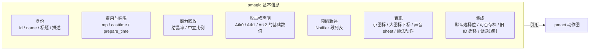
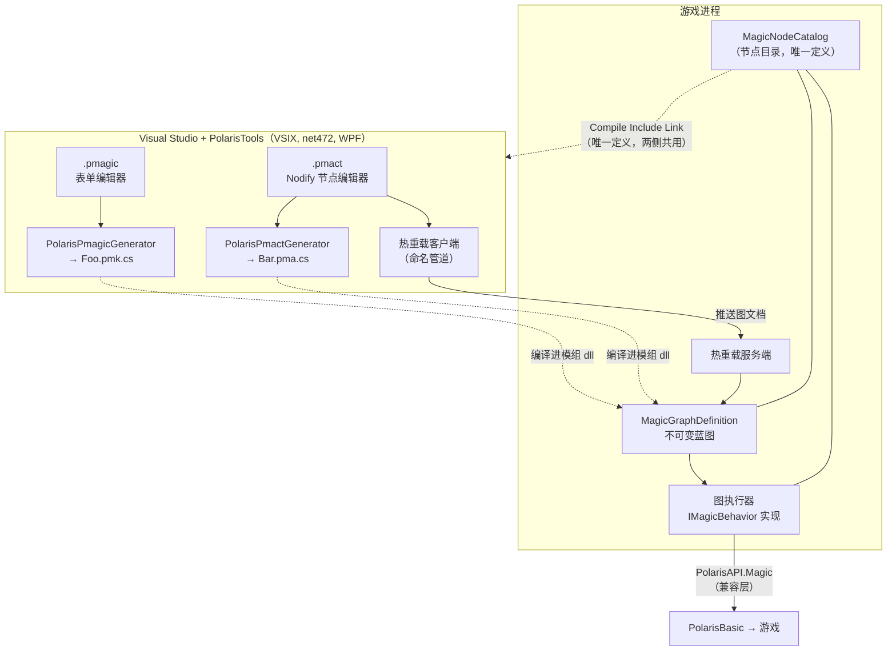
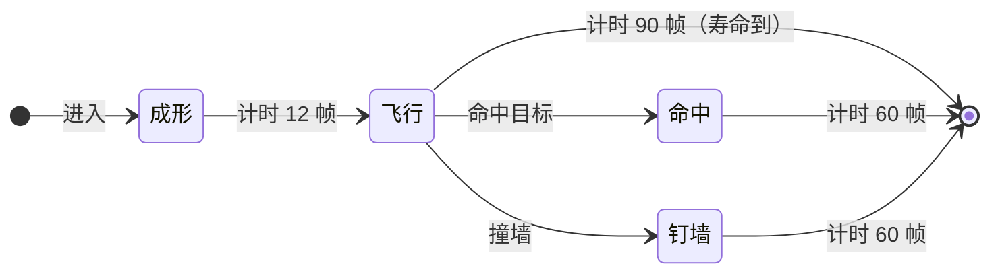

# PolarisMagic 自定义魔法系统：两段式定义 + 节点编辑器方案

> 本文是 [`PolarisMagic-实现方案.md`](PolarisMagic-实现方案.md) 的续篇，**只讲"魔法怎么定义、
> 怎么编辑"**。前一份讲的是分层与兼容层（所有 Harmony 补丁在 PolarisBasic、抽象 API 给
> PolarisMagic），引用时写"§兼容层方案 §x"。
> 依据：《魔法文档》= `C:\Users\Administrator\Documents\polarisDocs\魔法系统技术文档-LLM 可读版.md`；
> 代码依据 = `E:\Projects` 下五个项目，尤其是 PolarisTools 现有的 `.puisln` 节点编辑器。
> 按你的要求，**"魔法怎么获取"不在本文范围内**。
> 写作日期：2026-08-10。

---

## 0. 先给结论

1. **你的两段式划分与游戏结构天然吻合**，不是外加的抽象。《魔法文档》§21.7 说一种咏唱法术
   会**初始化两次**：准备态（咏唱圆，`casttime > 0`、非 `IMMEDIATE`）和正式实体
   （`IMMEDIATE`、`casttime = 0`）。前者的行为**原版自带**（通用 `runMagicCircle`），只吃数据；
   后者才是每种法术各不相同的状态机（`MgWhiteArrow.run` 那一层）。
   所以：**基本信息 = 喂给准备态与 UI/存档的数据；释放后的动作 = 正式实体的状态机**。
   这条对应关系是整套设计的地基。

2. **两个文件、两个编辑器**：
   - `.pmagic` —— 基本信息。表单式编辑器，参照现有 `.plang` 编辑器（表格 + 对话框）。
   - `.pmact` —— 释放后动作图。节点编辑器，参照现有 `.puisln`（Nodify）。
   `.pmagic` 引用一个 `.pmact`；同一份 `.pmact` 可以被多个 `.pmagic` 复用（同一套动作、不同数值）。

3. **动作图分两层，不是一层**：
   - **上层：阶段图**（节点 = 阶段 ≈ 原版 `phase`，边 = 转移条件）。它与 `.puisln` 的状态机图
     **同构**，可以直接复用现有 Nodify 编辑器的 ViewModel 层。
   - **下层：阶段内动作图**（exec 引脚 + 数据引脚，蓝图式）。这才是"各种节点实现自定义动作"。
   分两层的理由见 §3.1——一层扁平 exec 图既表达不好"这个阶段持续 22 帧"，运行时也更容易写出
   每帧几百次跳转的图。

4. **节点语义只有一处实现。** 图 →（编译期或运行期）→ 不可变蓝图 `MagicGraphDefinition` →
   运行时节点实例执行。VSIX 里的单文件生成器**只生成"构图代码"，不生成"行为代码"**——
   完全照 `PolarisPuislnGenerator` 生成 `PUIGraphDefinition.CreateBuilder(...).Node(...).Edge(...)`
   的做法（`PolarisTools/Pui/PuiSolutionsEditor/PolarisPuislnGenerator.cs:285-289`）。
   于是"解释执行"和"生成代码"不可能语义分叉，这一点在你们的 csproj 注释里已经立过规矩：
   *"三条路径因此共用同一份规则，不会出现'预览按一套、真机按另一套'"*。

5. **节点目录（catalog）的唯一定义放在 PolarisMagic 里**，PolarisTools 用
   `<Compile Include="$(PolarisMagicDir)\..." Link="..."/>` 链接过来——和 `PuiWireProtocol.cs`、
   `LocalizedString.cs`、`PlangDocument.cs` 三处现有先例完全一致（`PolarisTools.csproj:60-90`）。
   编辑器里的引脚、编译期的校验、运行时的执行因此共用同一张表，不会"编辑器有这个节点、
   游戏里没有"。

6. **每帧执行必须零分配。** `MagicItem.run` 是每帧每存活实例都走的路径（《魔法文档》§6.5 说
   `CircleCast` "很热"）。所以：变量按**编译期解析好的槽位下标**存取（不查字典、不装箱）、
   上下文按 `ref struct` 传、tick 路径里没有 LINQ/闭包/`params`。外加**每帧步数预算**——
   图里写出死循环不能变成"游戏卡死、看门狗指认 PolarisMagic"（§4.4）。

7. **热重载值得做，而且现成路子在那儿**：命名管道 + 共享线协议 + `[PUIHotFixEnabled]` 式的
   opt-in（`PolarisUI/PUI/HotReload/PuiHotReloadServer.cs:11-24`）。改一个法术的动作图，
   游戏里下一次施法即生效——这是这套编辑器能不能真的提高效率的分水岭。注意现有
   `.puisln` **不支持**热重载（只有叶子 `.pui` 支持），我们这次要反过来：图本身就是热重载单位。

---

## 1. 两段怎么切

### 1.1 切分依据

| 判据 | 归"基本信息"（`.pmagic`） | 归"释放后动作"（`.pmact`） |
| --- | --- | --- |
| 谁读它 | 准备态咏唱圆、HUD、选择器、存档、预瞄 | 只有正式实体的状态机 |
| 什么时候要就位 | `MKind` 注入时（`MTR.preparedT`，早于读档） | 第一次创建正式实体时 |
| 改了以后 | 只影响**之后**创建的实例（《魔法文档》§21.3） | 只影响之后创建的正式实体 |
| 谁在游戏侧承载 | `MKind` + `MDAT` 建的 Atk 槽 + `MagicNotifiear` | `MgFDHolder.run/draw` 的等价物 |

### 1.2 `.pmagic`（基本信息）字段



两个字段的归属值得单独说明，因为它们看着像"动作"却必须留在基本信息里：

- **攻击槽（Atk0/1/2）的声明**留在基本信息。原因是硬约束：《魔法文档》§21.6 要求
  **Atk 必须先建、`MKind.initMagic` 后写**（否则 `knockback_len` /
  `tired_time_to_super_armor` 丢失），而那一步发生在动作图还没开始跑之前。
  动作图能做的是"这一击用哪一份、临时改多少"，不是"凭空造一份"。
- **预瞄轨迹（Notifier）**留在基本信息。它在咏唱阶段就要画给玩家看，那时正式实体还不存在；
  《魔法文档》§21.11 也要求兼容层用显式模板重载安装它。动作图可以**读**它、可以在运行时
  `SetRay` 重算（原版状态机就是这么干的，§6.3），但模板本身是数据。

### 1.3 两段之间的接口

动作图能看见基本信息的**只读投影**：`费用预算`（= `ManaBudget`，注意它在正式实体里的语义是
"还能返还多少"，见《魔法文档》§5.8 与 §兼容层方案 §3.3）、`攻击槽`、`预瞄段`、`投射物强度`、
`法杖品级`。反向不成立：动作图不能改基本信息，那会让 HUD 与实际不一致。

---

## 2. 文件与工具链全景



新增文件类型与扩展名（注意避开已占用的生成扩展名——`.pui` 用 `.g.cs`、`.puisln` 用 `.psg.cs`，
见 `PolarisPuislnGenerator.cs:35-37` 的撞名注释）：

| 文件      | 编辑器                | 生成器输出   | 说明                       |
| --------- | --------------------- | ------------ | -------------------------- |
| `.pmagic` | 表单（照 Plang 编辑器） | `.pmk.cs`    | 基本信息 + 引用哪张动作图  |
| `.pmact`  | 节点图（照 puisln 编辑器） | `.pma.cs` | 动作图                     |

两个生成器都是 `IVsSingleFileGenerator`，**各自一个新 GUID**——`PolarisPuislnGenerator.cs:24-25`
已经踩过这个坑："两个 COM 可见的单文件生成器类如果共享同一个 CLSID，VS 按 CLSID 做的生成器
分发会互相踩"。

---

## 3. 动作图的模型

### 3.1 为什么是两层

原版八种法术的 handler 全都是 `phase` switch + 每帧推进（《魔法文档》§8.2 的白箭状态图、
§10.4 的地雷状态机、§14.1 的黑洞状态机都是这个形状）。如果做成一层扁平 exec 图：

| 一层扁平图的问题 | 两层的解法 |
| --- | --- |
| "这个阶段持续 22 帧然后转下一段"要用 latent 节点/协程模拟，图上看不出时序 | 阶段节点自带 `持续时间/转移条件`，一眼看出状态机 |
| 每帧要从入口重走整张图，图一大就是每帧几百次节点跳转 | 每帧只走**当前阶段**那一小张图 |
| 和游戏的 `phase` 字段对不上，调试/日志（《魔法文档》§23.4 的 `phase` 字段）没法用 | 阶段编号直接映射 `MagicInstance.Phase`，日志与原版可比对 |
| 与现有 `.puisln` 编辑器不同构，编辑器要从零写 | 上层直接复用 `.puisln` 的 ViewModel 层（§5.1） |

所以：**上层阶段图管"什么时候"，下层动作图管"做什么"**。



每个阶段节点内部再是一张动作图：

```text
阶段「飞行」
  ┌ 进入阶段 ──► 播粒子("ice_lance_fly") ──► 立即返还比例(0.66)
  └ 每帧(fcnt) ──► 朝目标转向(最大 3°/帧) ──► 按速度移动 ──► 发射Ray(线形, 长=速度, 粗=0.4)
                                                      │
                                                      └─(命中)──► 用攻击槽(Atk0) ──► 转到阶段(命中)
```

### 3.2 阶段图的元素

| 元素 | 含义 | 对应原版 |
| --- | --- | --- |
| **入口节点**（唯一、不可删） | 正式实体创建后的第一个阶段 | `phase = 0` |
| **阶段节点** | 一个 `phase`；带一张内部动作图 | `MgX.run` 里的一个 case |
| **出口节点**（唯一、不可删） | 法术结束（`OnTick` 返回 false） | kill / 回收 |
| **转移边** | 从阶段的某个"出口条件"连到另一个阶段 | `Mg.phase = n` |
| **内建转移条件** | 计时到期 / 命中任意目标 / 撞墙 / 落地 / 出屏 / 魔力预算耗尽 / 再次施法 / 施法者消失 | 各 handler 里的分支 |
| **自定义转移条件** | 动作图里的"触发转移"节点，或一个布尔数据引脚 | —— |

入口/出口固定且不可删，和现有 `EditorViewModel.EnsureEntryNode/EnsureExitNode`
（`EditorViewModel.cs:71-83`）一模一样的做法；出口节点的 key 也照 `PUIEdge.ExitNodeKey = "@Exit"`
的约定（`PolarisUI/PUI/Graph/PUIEdge.cs:11-17`）。

### 3.3 动作图的引脚类型

蓝图式：**exec 引脚**（白色，控制流）+ **数据引脚**（按类型着色）。

| 数据类型 | 说明 | 编辑器颜色建议 |
| --- | --- | --- |
| `Float` / `Int` / `Bool` | 标量 | 绿 / 青 / 红 |
| `Vec2` | 位置/速度（游戏是 2.5D，z 单独给） | 黄 |
| `Angle` | 角度，单独一类以免和 Float 混用出弧度/度的错 | 橙 |
| `Target` | 一个可攻击目标的句柄（不是引用——池化对象不能长期持有，见《魔法文档》§2.3） | 紫 |
| `AttackSlot` | Atk0/1/2 之一 | 红褐 |
| `RayShape` | 形状 + 目标位 | 蓝 |
| `Handle` | 粒子/声音/光源的运行时句柄 | 灰 |

`CanConnect` 要在类型层面拒绝（现有实现只判方向和"输出至多一条边"，
`EditorViewModel.cs:388-401`；这里要扩成"exec 输出至多一条、数据输出可多条、类型必须相容"）。

### 3.4 节点目录（第一版清单）

按类分。**每一行都能在《魔法文档》里找到原版对应**——这是控制"节点集不要凭空发明"的办法：
先做能复刻原版八种的最小集，再扩。

| 类 | 节点 | 原版依据 |
| --- | --- | --- |
| **事件** | 进入阶段 / 每帧 / 命中 / 撞墙 / 离开阶段 / 法术结束 / 再次施法 / 地图退出 | 《魔法文档》§21.16 的事件集、§21.14 的地图语义 |
| **流程** | 分支 / 顺序 / 计数循环 / 单次门 / 概率 / 整数分支 | —— |
| **移动** | 按速度移动 / 加速 / 朝点转向（限最大角速度）/ 重力 / 阻尼 / 环绕 / 四次方扩张 / 贴附目标 / 钉在墙上 | 火球三次转向 §9.2、威力炸弹四次方 §12.2、白箭黏附 §8.2 |
| **判定** | 发射 Ray / 圆形范围判定 / 选用攻击槽 / 临时改攻击数值 / 设置命中锁 / 设置最大命中数 | `CircleCast` §6.5、hit lock §6.4 |
| **魔力** | 立即返还比例 / 设置结晶率 / 接入持续占用槽 / 退款（幂等） | 白箭 66% §8.4、`SpecialMpGauge` §6.8 |
| **表现** | 播/停粒子 / 播声音 cue / 光源 / 绘制帧 / 屏幕震动 | §18.1 粒子、§18.2 ACB |
| **查询（纯节点）** | 阶段时间 t / 帧倍率 / 施法者位置 / 瞄准点 / 锁定目标 / 到目标距离 / 剩余魔力预算 / 法杖品级 / 投射物强度 | §5.9 光标、§4.1 法杖 |
| **数学（纯节点）** | 四则 / 夹取 / 线性插值 / `Scr(a,b)` / 三角 / 随机（带实例种子）/ 向量构造与分解 | `Scr` 的定义见 §4.2，**必须提供**，否则作者会自己写错 |
| **变量** | 取变量 / 存变量（图内声明的实例变量） | —— |
| **转移** | 转到阶段 / 结束法术 | —— |
| **子实体** | 生成同族子实体 / 读写共享族状态 | 地雷拆两颗 §10.3、水晶八颗共享 family §13.1 |

> **两个刻意的限制。**
> 1. `子实体` 类第一版**不公开**：它依赖兼容层里最不确定的两块（族对象的逐成员释放、
>    `MagicItem.Other` 的接口优先级，《魔法文档》§21.14），先在内部示例里用，稳了再放出来。
> 2. **没有"直接改玩家 MP/HP"的节点**。花环不是凭空治疗，是加速玩家已有的 GaugeSaver
>    （§15.3）；给一个"治疗 N 点"的节点会诱导作者写出原版做不到的东西，回头再对不上。

### 3.5 变量与零分配

```text
图里声明：  speed: Float = 2.4     turns: Int = 0     stuckTo: Target
              ↓ 编译期（Build 时）解析成槽位
运行时：    float[] f = new float[2];  int[] i = new int[1];  TargetHandle[] t = new TargetHandle[1];
              ↑ 每个 MagicInstance 一份，从 State<T>() 拿（兼容层负责池化复用时清零）
```

- 槽位下标在 `MagicGraphDefinition` 构建时定好，运行时**没有按名字查表**。
- 纯节点（数据节点）**每帧每实例只求值一次**，结果缓存在同一组槽位里；避免"一个数据引脚被
  三个地方引用就求值三遍"。
- 上下文用 `ref` 传的结构体，节点实现是**无状态**的（状态全在实例槽位里）——所以一份
  `MagicGraphDefinition` 可以被任意多个实例共用，正好对上兼容层要求的"每个 `MGContainer`
  一个 behavior 实例、但蓝图共享"（《魔法文档》§21.10）。

---

## 4. 运行时执行器

### 4.1 它就是一个 `IMagicBehavior`

节点图不是第二套运行机制，它是 §兼容层方案 §3.4 那个接口的**一种实现**：

```csharp
/// <summary>
/// 图驱动的行为：把 MagicGraphDefinition 解释执行。手写 C# 行为（Behaviors/ 下那五个模板）
/// 和图驱动行为是同一个接口的两种实现，兼容层不知道也不关心区别。
/// </summary>
internal sealed class MagicGraphBehavior : IMagicBehavior
{
    readonly MagicGraphDefinition definition;

    public void OnSpawn(MagicInstance m)
    {
        ref MagicGraphState s = ref m.State<MagicGraphState>().Reset(definition);
        RunPhaseEntry(m, ref s, definition.EntryPhase);
    }

    public bool OnTick(MagicInstance m, float fcnt)
    {
        ref MagicGraphState s = ref m.State<MagicGraphState>();
        return Execute(m, ref s, definition.Phases[s.Phase].OnTick, fcnt);
    }
    // OnHit / OnEnd / OnRecast / OnMapDeactivating 同理，各自跑对应入口
}
```

### 4.2 阶段转移的时机

**在一帧的动作图跑完之后统一转移**，不是节点一执行就立刻切换。理由：图中间切阶段会让同一帧
里既跑了旧阶段的后半段、又跑了新阶段的前半段，作者按图上顺序理解不了实际行为。所以
`转到阶段` 节点只写一个"待转移"标记，帧末生效——同一帧内多个转移请求，**第一个赢**并记一行
调试日志（不是最后一个赢：第一个赢与"图从上往下读"的直觉一致）。

### 4.3 与原版数值的对齐

执行器不自己算物理。移动节点最终写的是 `MagicInstance.Position/Velocity`，判定节点走的是
兼容层的 `MagicRayQuery` → `MGContainer.CircleCast`。这条纪律很重要：**任何"我们自己算一遍"
都会和原版的时间倍率/法杖修正对不上**（《魔法文档》§4.2 的修正顺序、§22 里 WaterShard 那条
"某移动分支重复乘 fcnt"就是这类问题的现成教训）。

### 4.4 死循环与步数预算

图里能写出环（A 的 exec 连回 A）。两道防线：

1. **编译期**：`MagicGraphDefinition.Validate()` 检测 exec 图里的环——照
   `PUIGraphDefinition.Validate()` 的做法（`PUIGraphDefinition.cs:57-96`），在 Build 时抛，
   而不是等运行时。
2. **运行期**：每实例每帧的**节点步数预算**（默认 512）。超预算就：立刻停这一帧的执行 →
   `PolarisAPI.Errors.Report`（责任方 = 该图所属模组的程序集）→ 杀掉这个法术实例 →
   同一张图第二次触发就把它整张禁用掉，别每帧刷屏。
   理由：`MagicItem.run` 在主线程上，真死循环就是**游戏卡死**，而 PolarisBasic 的看门狗
   （`Diagnostics/Watchdog.cs`）会把它记成一次卡死报告。与其让玩家交一份"卡死在
   PolarisMagic"的报告，不如当场杀掉一个法术并说清是哪张图哪个节点。
   执行时顺便用 `MainThreadBeat.Enter($"魔法图 {name} 阶段 {phase}")` 留面包屑——
   `GameStateAPI.Pump` 里已经是这个套路（`GameApi/GameStateAPI.cs:145-147`）。

---

## 5. 编辑器（PolarisTools）

### 5.1 先重构，再开新窗口

现有 Nodify 基础设施在 `PolarisTools/Pui/PuiSolutionsEditor/ViewModel/` 下：
`EditorViewModel`(462 行) / `NodeViewModel` / `ConnectorViewModel` / `ConnectionViewModel` /
`PendingConnectionViewModel` / `NodeTypeFactory` + `INodeTypeDescriptor` + `Descriptors`。

它有 80% 是通用图编辑逻辑（连线、脏标记、增删节点、序列化定位、刷新节点时按 Id 迁移连线），
20% 是 PUI 专属（`PuiFilePath`/`PuiName`/`LoadStateTransitions`）。

**第 0 步是把通用部分抽到 `PolarisTools/Graph/` 下**，`PuiSolutions` 与新的 `MagicAct`
各自派生。不许 fork-copy：`RefreshPuiStateNode` 里"按 Id 把旧连线迁移到刷新后的新连接器上"
（`EditorViewModel.cs:107-136`）这种逻辑，抄两份就一定会只修一份。

| 抽出去（`Graph/`）                                              | 留在各自的编辑器                        |
| --------------------------------------------------------------- | --------------------------------------- |
| 连线增删、方向归一化、`IsConnected` 维护、强制断开              | `CanConnect` 的**类型规则**（各自不同） |
| 脏标记与 `IsDirtyChanged`、Entry/Exit 保底                      | 节点描述符集合                          |
| 节点定位与 JSON 序列化骨架、相对路径换算（net472 无 `GetRelativePath`，见 `EditorViewModel.cs:150-159`） | 文档 DTO 的专属字段     |
| 按 Id 迁移连线                                                  | "刷新节点"从哪里读新的连接点列表        |

### 5.2 `.pmact` 编辑器要有的功能

| 功能 | 说明 | 参照 |
| --- | --- | --- |
| 双层导航 | 阶段图（默认视图）↔ 双击进入某阶段的动作图；面包屑返回 | —— |
| 节点面板 | 按 §3.4 的类分组 + 搜索框 | —— |
| 拖线搜节点 | 从引脚拖到空白处，弹出**按类型过滤**的搜索框（只列能接上这个引脚的节点）。这是节点编辑器好不好用的关键一项 | —— |
| 引脚着色与类型校验 | §3.3 的颜色；`CanConnect` 拒绝不相容连接 | `EditorViewModel.CanConnect` |
| 属性面板 | 选中节点后编辑常量参数 | 复用 `PuiNumberBox` / `PuiColorPicker` / `PuiStringListEditor` |
| 本地化键补全 | 文案参数支持 `&key`，从 `.plang` 补全 | 复用 `PlangKeyCatalog` |
| 资源补全 | 粒子名 / 声音 cue / PXLS 帧名下拉 | 复用 `PolarisResAvailability` 的思路 |
| 在编辑器里校验 | 未连接的必需引脚、类型不符、阶段不可达、无 `每帧`/`进入阶段` 入口、exec 环、数值越界 | 错误经 `IVsGeneratorProgress.GeneratorError` 进错误列表，照 `PolarisPuislnGenerator.cs:116,193-211` |
| 刷新与重命名安全 | 节点参数引用了 `.pmagic` 的攻击槽/预瞄段时，那边改了要能刷新并保留连线（按 Id 匹配） | `RefreshPuiStateNode` |
| Item Template | "添加新项"里出现 `.pmagic` / `.pmact` | 照 `ItemTemplates/Polaris/PuislnFile` |

### 5.3 节点目录的单一定义（关键设计）

编辑器要知道每个节点的标题/分类/引脚/参数，运行时要知道怎么执行。**分两个文件**：

```
PolarisMagic/
  Graph/
    MagicNodeCatalog.cs        ← 唯一定义：节点 id、分类、标题、引脚、参数。
                                 刻意不引用 UnityEngine / 游戏程序集 / PolarisBasic 的其它类型
    Nodes/*.cs                 ← 实现：执行逻辑（引用 Unity 与兼容层）
```

```xml
<!-- PolarisTools/Directory.Build.props：照 PolarisLangDir/PolarisUIDir/PolarisBasicDir 的写法加一条 -->
<PolarisMagicDir Condition="'$(PolarisMagicDir)' == '' And '$(POLARIS_MAGIC_DIR)' != ''">$(POLARIS_MAGIC_DIR)</PolarisMagicDir>
<PolarisMagicDir Condition="'$(PolarisMagicDir)' == ''">$(MSBuildThisFileDirectory)..\PolarisMagic</PolarisMagicDir>
```

```xml
<!-- PolarisTools.csproj -->
<ItemGroup>
  <Compile Include="$(PolarisMagicDir)\Graph\MagicNodeCatalog.cs" Link="Magic\Shared\MagicNodeCatalog.cs" />
  <Compile Include="$(PolarisMagicDir)\Graph\MagicGraphDocument.cs" Link="Magic\Shared\MagicGraphDocument.cs" />
</ItemGroup>
```

外加 `Directory.Build.props` 里的 `CheckPolarisMagicDir` 报错 target——现有那个 target 已经
给三个目录各写了一条能看懂的提示，加第四条。

`MagicGraphDocument.cs`（`.pmact` 的 JSON DTO）也**唯一定义在 PolarisMagic 里**，因为运行时
热重载要解析同样的文档。这比 `.puisln` 的现状更进一步：那边的 `PuislnDocument` 只在 VSIX 侧，
因为游戏侧不需要读它。

> **第三方自定义节点**：链接文件的做法意味着节点集在编译期固定，第三方模组加的节点编辑器
> 看不见。解法留到后期（§7 的 N7）：PolarisMagic 启动时把运行时注册的节点导出成
> `*.pnodes.json`，编辑器扫描解决方案目录加载。第一版接受"节点集固定"。

### 5.4 热重载

```text
编辑器保存/改图 → 命名管道 "Polaris.Magic.HotReload" → 游戏侧服务端
  → 重建该图的 MagicGraphDefinition（Validate 失败就拒绝并回报错误文本，不替换旧的）
  → 已在场上的实例保持旧蓝图跑完（避免半途换状态机）；下一次施法用新的
```

- 协议文件唯一定义在 PolarisMagic 里，PolarisTools 链接过来——照 `PuiWireProtocol.cs` 的
  头注释那三条改动规则（opcode 只追加、镜像枚举只追加、改字节序列就 +1 版本号）。
- **opt-in**：照 `[PUIHotFixEnabled]` 的做法（`PuiHotReloadServer.cs:12-15`），只有标了
  `[PolarisMagicHotFixEnabled]` 的程序集存在时才起监听线程；纯发布环境零开销。
- 与 `.puisln` 的差别要在文档里写清楚：那边"改图必须重新触发生成器"，这边图本身可热重载。
  两者不一致会让人困惑，值得一句解释——因为魔法图的迭代频率（调一个数值试手感）比 UI
  状态机高一个量级。

### 5.5 实时探针（后期）

反向通道：游戏把"当前阶段、变量值、上一帧命中数"回传，编辑器在阶段节点上加高亮和数值气泡。
这是把编辑器从"画图工具"变成"调试器"的一步，但它依赖热重载通道已经稳定，排在最后。

---

## 6. `.pmagic` 编辑器

比图编辑器简单得多，但有三件必须做对：

1. **id 唯一性与冲突预检**。编辑器里就扫解决方案内所有 `.pmagic`，撞 id 当场标红——真正的
   致命判定在运行时（§兼容层方案 §4.4），但让作者在 VS 里就看见比在游戏里看见好。
2. **存档相关字段的警示**。勾了"可存档"就意味着 id 从此不能改（改了旧档会变成另一种法术，
   《魔法文档》§20.2）。编辑器要把这句话摆在勾选框旁边，不是藏在文档里。
3. **图标下标的合法值**。大图标数组没有越界保护（§18.4），所以这个字段做成**下拉**
   （0–8 复用原版）而不是自由输入的数字框。

---

## 7. 里程碑

编号 N，与 §兼容层方案 的 M 并行推进；括号里是它依赖的 M。

| N | 名称 | 交付 | 依赖 |
| - | --- | --- | --- |
| **N0** | 图基础设施重构 | 把 `PuiSolutionsEditor` 的通用图逻辑抽到 `PolarisTools/Graph/`，`.puisln` 编辑器改用它并保证行为不变（这是纯重构，先做完再动新功能） | —— |
| **N1** | 数据格式与目录 | `MagicNodeCatalog` + `MagicGraphDocument` 定稿并跨项目链接；`Directory.Build.props` 的第四条检查；`.pmagic`/`.pmact` Item Template | —— |
| **N2** | `.pmagic` 表单编辑器 + 生成器 | 基本信息能编、能生成 `.pmk.cs`、能被兼容层登记；此时法术还没有动作（用手写的 `Behaviors/` 模板顶上） | M4 |
| **N3** | 阶段图（上层） | Nodify 编辑器出图、阶段/转移条件、生成 `.pma.cs`、运行时执行器跑通"三阶段直射弹" | M4/M5 |
| **N4** | 动作图（下层） | exec + 数据引脚、§3.4 前六类节点、拖线搜节点、类型校验、属性面板 | N3 |
| **N5** | 校验与诊断 | 编译期环检测/未连接引脚/不可达阶段；运行期步数预算与图级熔断；结构化日志接《魔法文档》§23.4 字段 | N4 |
| **N6** | 热重载 | 线协议 + 命名管道 + opt-in 特性；改图即生效 | N4 |
| **N7** | 作者体验收尾 | 资源/文案补全、示例图（复刻白箭 + 一个持续场）、第三方节点清单导出、作者文档 | N6、M7 |

**N0 先做**的理由：如果先开新窗口再回头重构，两套图编辑器就已经分叉了，重构成本翻倍——
而 `.puisln` 编辑器现在还小，正是抽公共层最便宜的时候。

---

## 8. 风险

| 风险 | 影响 | 缓解 |
| --- | --- | --- |
| 节点集设计过早发散 | 做出一堆节点却复刻不出任何一种原版法术 | 验收标准定死：**N4 结束时必须能用图复刻白箭**（§8.2 的状态机），做不到就是节点集不对，不是"再加几个节点" |
| 每帧执行的 GC/性能 | 场上八颗水晶 + 一个黑洞时掉帧 | §3.5 的零分配约束；N5 加一个"图执行耗时"统计，超过阈值在调试 HUD 上标红 |
| 图里写出死循环 | 游戏卡死，看门狗记成 PolarisMagic 的卡死 | §4.4 的双防线（编译期环检测 + 运行期步数预算与熔断） |
| 两层图让简单法术变啰嗦 | 一个"直接爆炸"的法术也要建三个阶段 | 提供**单阶段模板**：新建 `.pmact` 默认就一个阶段，只有需要时才加 |
| 热重载与存档/场上实例的交互 | 改图导致场上实例状态机错位 | 已在场的实例跑完旧蓝图，只有新实例用新图（§5.4） |
| 生成代码与热重载路径分叉 | "编译进去的和推进去的行为不一样" | 生成器只生成**构图代码**，语义只有运行时一份（§0.4） |
| 编辑器不知道第三方节点 | 生态受限 | 第一版接受固定节点集；N7 出清单文件方案 |
| `.pmagic` 的 id 被改 | 玩家旧档里的法术变成另一种 | 编辑器警示 + 运行时 `LegacyIds` 迁移（§兼容层方案 §5.5） |

---

## 9. 需要你拍板的三件事

| # | 问题 | 选项 | 我的推荐 |
| - | --- | --- | --- |
| 1 | 动作图分两层（阶段图 + 阶段内动作图），还是一层扁平 exec 图？ | (a) 两层<br/>(b) 一层，用 latent 节点表达等待 | **(a)**，理由见 §3.1；一层图在"每帧运行"这个前提下会又慢又难读 |
| 2 | 基本信息和动作图分两个文件，还是一个文件两个页签？ | (a) 两文件（`.pmagic` 引用 `.pmact`），动作图可复用<br/>(b) 单文件双页签，概念上"一个法术就是一个文件" | **(a)**——和 `.puisln`→`.pui` 的现有分法一致，且"同一套动作不同数值"是魔法模组里很常见的需求 |
| 3 | 热重载做到哪一层？ | (a) 只推动作图（N6）<br/>(b) 动作图 + 基本信息都能推<br/>(c) 再加实时探针（高亮当前阶段、显示变量） | **(a) 起步，(b) 顺带**（基本信息的覆盖层本来就在兼容层手里，重建不难）；**(c) 放最后**，它最香但依赖前两者稳定 |

---

## 附录 A：`.pmact` 文档结构草案

沿用 `PuislnDocument` 的形状（版本号 + 节点数组 + 连线按下标引用），只是多了一层：

```jsonc
{
  "version": 1,
  "variables": [
    { "name": "turns", "type": "Int", "initial": "0" }
  ],
  "phases": [
    {
      "name": "成形", "x": 40, "y": 40, "isEntry": true,
      "exits": [                                  // 阶段节点的输出连接器
        { "id": "a1f2…", "kind": "Timer", "frames": 12, "label": "12 帧后" }
      ],
      "graph": {                                  // 阶段内的动作图
        "nodes": [
          { "id": "n1", "type": "Event.OnEnter", "x": 0,   "y": 0 },
          { "id": "n2", "type": "Fx.PlayParticle", "x": 200, "y": 0,
            "params": { "name": "ice_lance_form" } }
        ],
        "links": [
          { "from": "n1:exec", "to": "n2:exec" }
        ]
      }
    }
  ],
  "transitions": [
    { "fromPhase": 0, "exitId": "a1f2…", "toPhase": 1 },
    { "fromPhase": 1, "exitId": "b3c4…", "toPhase": "@Exit" }
  ]
}
```

两点刻意的选择：
- 连线用**稳定 id**（`"n1:exec"`）而不是 `.puisln` 那样的节点下标 + 连接器下标。下标方案在
  节点/引脚数量变化时很脆（现有代码要靠 `SourceTransitionId` 补救，见
  `ConnectorViewModel.cs:16-18`）；节点多了以后 id 更稳。
- 阶段的 `exits` 带 `id`，这样"改了转移条件的标签"不会断开已画的连线——同 `PuiStateTransition.Id`
  的用途（`PuiStateTransition.cs:22-25`）。

## 附录 B：生成代码长什么样

和 `PolarisPuislnGenerator` 的产物同构：只有构图，没有行为。

```csharp
// <auto-generated />
// Generated by polaris source code generator from IceLance.pmact
namespace MyMod.Magic;

[Polaris.Magic.MagicGraphAutoRegistration]
public static class IceLance_Act
{
    public const string GraphName = "IceLance";

    public static class Phases
    {
        public const int Forming = 0;
        public const int Flying  = 1;
        public const int Stuck   = 2;
    }

    static Polaris.Magic.Graph.MagicGraphDefinition definition;
    public static Polaris.Magic.Graph.MagicGraphDefinition Definition => definition ??= Build();

    static Polaris.Magic.Graph.MagicGraphDefinition Build()
        => Polaris.Magic.Graph.MagicGraphDefinition.CreateBuilder(GraphName)
            .Variable("turns", Polaris.Magic.Graph.MagicValueType.Int, "0")
            .Phase(Phases.Forming, entry: true)
                .Node("n1", "Event.OnEnter")
                .Node("n2", "Fx.PlayParticle", "name", "ice_lance_form")
                .Link("n1", "exec", "n2", "exec")
            .Phase(Phases.Flying)
                // …
            .Transition(Phases.Forming, "a1f2…", Phases.Flying)
            .ExitTransition(Phases.Stuck, "b3c4…")
            .Build();
}
```

## 附录 C：与现有 PUI 编辑器共享/借鉴的清单

| 现有件 | 位置 | 这次怎么用 |
| --- | --- | --- |
| Nodify 图编辑 ViewModel 全套 | `PolarisTools/Pui/PuiSolutionsEditor/ViewModel/` | **N0 抽出通用层**共用 |
| 单文件生成器骨架（含新 GUID 的坑） | `PolarisPuislnGenerator.cs` | 照抄结构，两个新 GUID |
| 不可变蓝图 + Builder + Validate | `PolarisUI/PUI/Graph/` | `MagicGraphDefinition` 同构 |
| `@Exit` 保留节点 key | `PUIEdge.cs:11-17` | 阶段图的出口沿用同一约定 |
| 命名管道热重载 + opt-in 特性 | `PolarisUI/PUI/HotReload/` + `PolarisTools/Pui/PuiVisualEditor/HotReload/` | 照做一套魔法通道 |
| 跨项目源码链接（唯一定义） | `PolarisTools.csproj:60-90` + `Directory.Build.props` | 节点目录与文档 DTO 用同一手法 |
| 小控件（数字框/取色器/字符串列表） | `PolarisTools/Pui/PuiVisualEditor/Controls/` | 属性面板直接复用 |
| `.plang` key 补全、PolarisRes 可用性探测 | `PlangKeyCatalog.cs` / `PolarisResAvailability.cs` | 文案与资源参数的补全 |
| 冲突 → 启动期致命错误 | `PolarisLang/Lang/PlangConflictGuard.cs` | id 冲突照它写（§兼容层方案 §4.4） |
| VSIX 打包第三方 dll 的 target | `PolarisTools.csproj` 末尾 | 不用改，新代码自动受益 |
